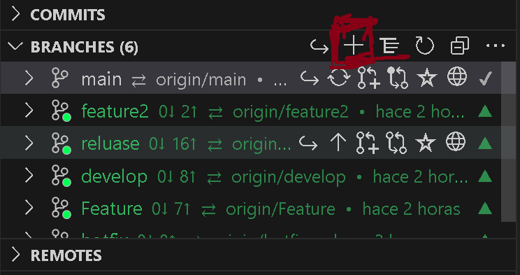
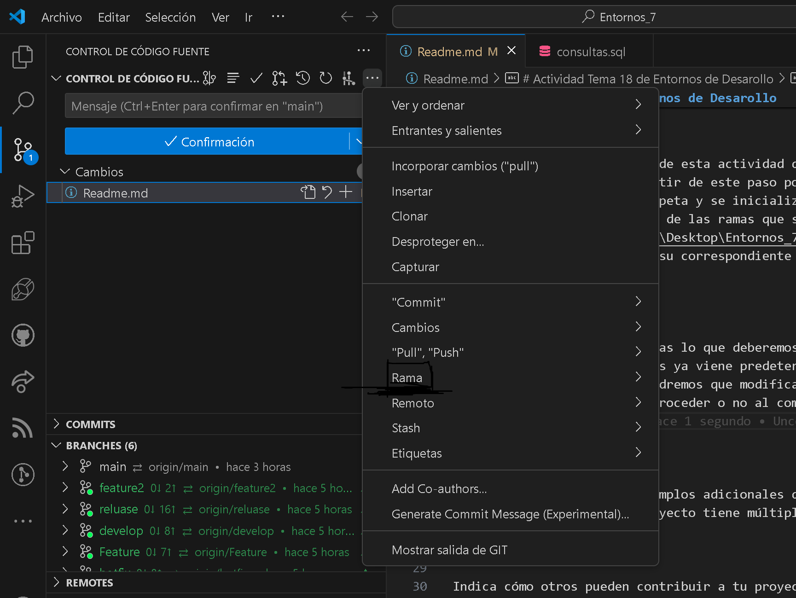

# Actividad Tema 18 de Entornos de Desarollo

Esta actividad se orienta en hacer una serie de ramas de trabajo para simular como seria un trbajo de ramas en la vida reala en una situacion de empresa real para poder mejorar.

## Tabla de Contenidos

1. [Instalación](#instalación)
2. [Uso](#uso)
3. [Ejemplos](#ejemplos)

## Instalación

Aqui empezamos con creacion de esta actividad que es crear una carpeta con un txt que este caso es main y apartir de este paso podemos publicar el repositorio que llamara como se llame la carpeta y se inicializara con el txt creado anteriormente para empezar con la creacion de las ramas que se crean asi:

Crearemos todas poniendo de su correspondiente nombre.

## Uso

Una vez creada todas las ramas lo que deberemos hacer es crear en caso necesario en caso de cada una de las ramas ya viene predeterminado un archivo que es el que creamos al principio que tendremos que modificarlo para en caso necesario depndiendo de la situacion proceder o no al combinar dos ramas que se haria de la sguiente manera iremos al apartado control del codigo fuente y le daremos a los tres puntos donde iremos a la opcion ramas y commbinar y unicamente ahi debemos selecionar la rama que queremos combinar.

## Ejemplos

Un ejemplo seria la primera y segunda rama que para combinarla he usado las pruebas.txt predeterminadas donde he ido a la segunda rama para ahi poder combinar la primera con la segunda indicandole en combinar la primera clase para poder combinar dichas ramas.

